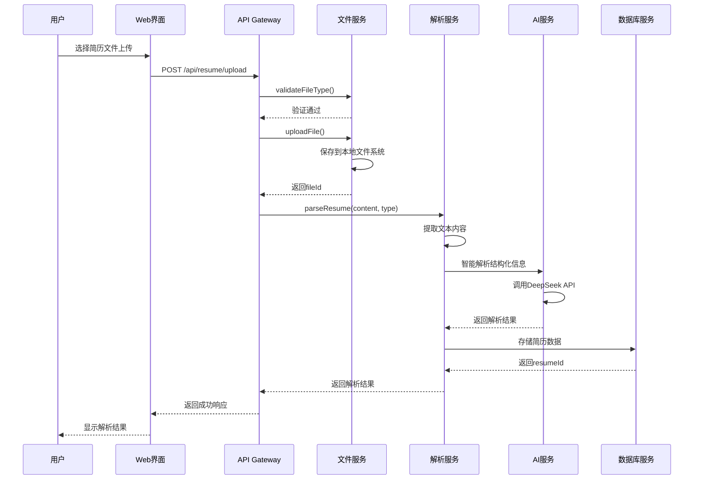
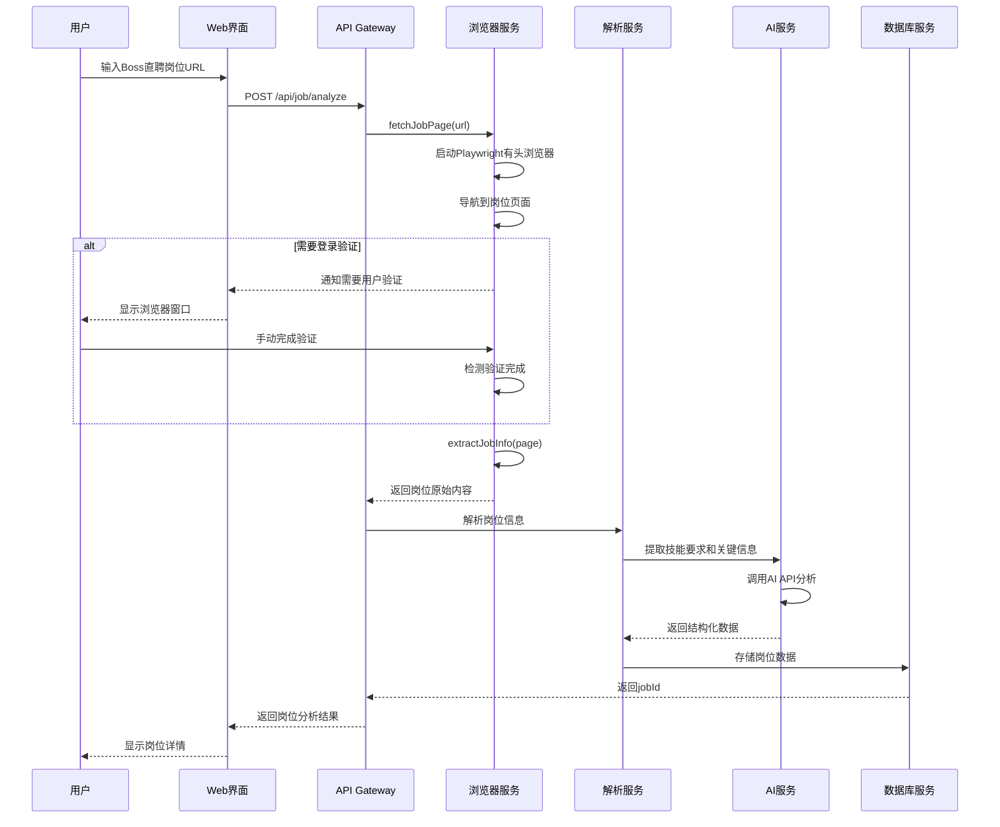
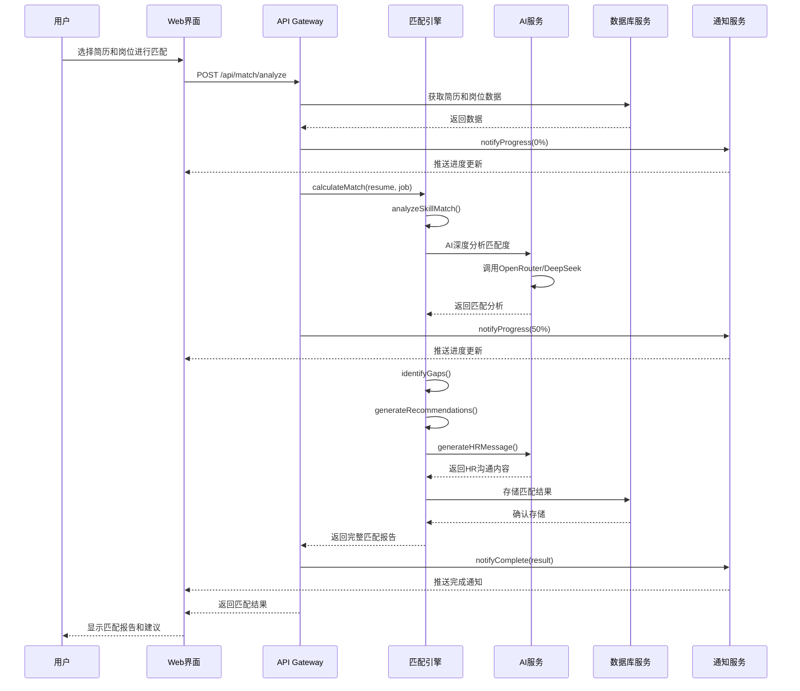
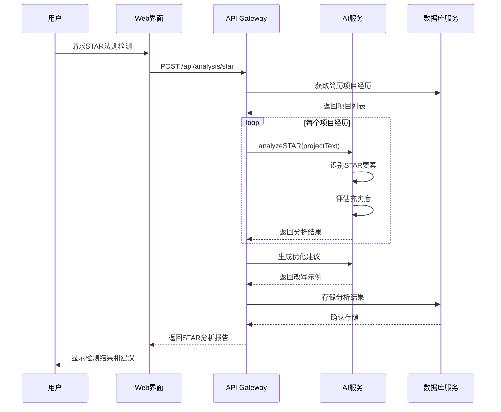

# 核心工作流程

使用序列图说明关键系统工作流程，基于PRD中的用户旅程：

## 简历上传与解析流程

```mermaid
sequenceDiagram
    participant U as 用户
    participant W as Web界面
    participant API as API Gateway
    participant FS as 文件服务
    participant PS as 解析服务
    participant AI as AI服务
    participant DB as 数据库服务

    U->>W: 选择简历文件上传
    W->>API: POST /api/resume/upload
    API->>FS: validateFileType()
    FS-->>API: 验证通过
    API->>FS: uploadFile()
    FS->>FS: 保存到本地文件系统
    FS-->>API: 返回fileId

    API->>PS: parseResume(content, type)
    PS->>PS: 提取文本内容
    PS->>AI: 智能解析结构化信息
    AI->>AI: 调用DeepSeek API
    AI-->>PS: 返回解析结果
    PS->>DB: 存储简历数据
    DB-->>PS: 返回resumeId
    PS-->>API: 返回解析结果
    API-->>W: 返回成功响应
    W-->>U: 显示解析结果
```

## 岗位获取与分析流程

```mermaid
sequenceDiagram
    participant U as 用户
    participant W as Web界面
    participant API as API Gateway
    participant BS as 浏览器服务
    participant PS as 解析服务
    participant AI as AI服务
    participant DB as 数据库服务

    U->>W: 输入Boss直聘岗位URL
    W->>API: POST /api/job/analyze
    API->>BS: fetchJobPage(url)
    BS->>BS: 启动Playwright有头浏览器
    BS->>BS: 导航到岗位页面

    alt 需要登录验证
        BS-->>W: 通知需要用户验证
        W-->>U: 显示浏览器窗口
        U->>BS: 手动完成验证
        BS->>BS: 检测验证完成
    end

    BS->>BS: extractJobInfo(page)
    BS-->>API: 返回岗位原始内容

    API->>PS: 解析岗位信息
    PS->>AI: 提取技能要求和关键信息
    AI->>AI: 调用AI API分析
    AI-->>PS: 返回结构化数据
    PS->>DB: 存储岗位数据
    DB-->>API: 返回jobId
    API-->>W: 返回岗位分析结果
    W-->>U: 显示岗位详情
```

## 简历岗位匹配分析流程

```mermaid
sequenceDiagram
    participant U as 用户
    participant W as Web界面
    participant API as API Gateway
    participant ME as 匹配引擎
    participant AI as AI服务
    participant DB as 数据库服务
    participant NS as 通知服务

    U->>W: 选择简历和岗位进行匹配
    W->>API: POST /api/match/analyze
    API->>DB: 获取简历和岗位数据
    DB-->>API: 返回数据

    API->>NS: notifyProgress(0%)
    NS-->>W: 推送进度更新

    API->>ME: calculateMatch(resume, job)
    ME->>ME: analyzeSkillMatch()
    ME->>AI: AI深度分析匹配度
    AI->>AI: 调用OpenRouter/DeepSeek
    AI-->>ME: 返回匹配分析

    API->>NS: notifyProgress(50%)
    NS-->>W: 推送进度更新

    ME->>ME: identifyGaps()
    ME->>ME: generateRecommendations()
    ME->>AI: generateHRMessage()
    AI-->>ME: 返回HR沟通内容

    ME->>DB: 存储匹配结果
    DB-->>ME: 确认存储
    ME-->>API: 返回完整匹配报告

    API->>NS: notifyComplete(result)
    NS-->>W: 推送完成通知
    API-->>W: 返回匹配结果
    W-->>U: 显示匹配报告和建议
```

## STAR法则检测流程

```mermaid
sequenceDiagram
    participant U as 用户
    participant W as Web界面
    participant API as API Gateway
    participant AI as AI服务
    participant DB as 数据库服务

    U->>W: 请求STAR法则检测
    W->>API: POST /api/analysis/star
    API->>DB: 获取简历项目经历
    DB-->>API: 返回项目列表

    loop 每个项目经历
        API->>AI: analyzeSTAR(projectText)
        AI->>AI: 识别STAR要素
        AI->>AI: 评估充实度
        AI-->>API: 返回分析结果
    end

    API->>AI: 生成优化建议
    AI-->>API: 返回改写示例

    API->>DB: 存储分析结果
    DB-->>API: 确认存储
    API-->>W: 返回STAR分析报告
    W-->>U: 显示检测结果和建议
```
