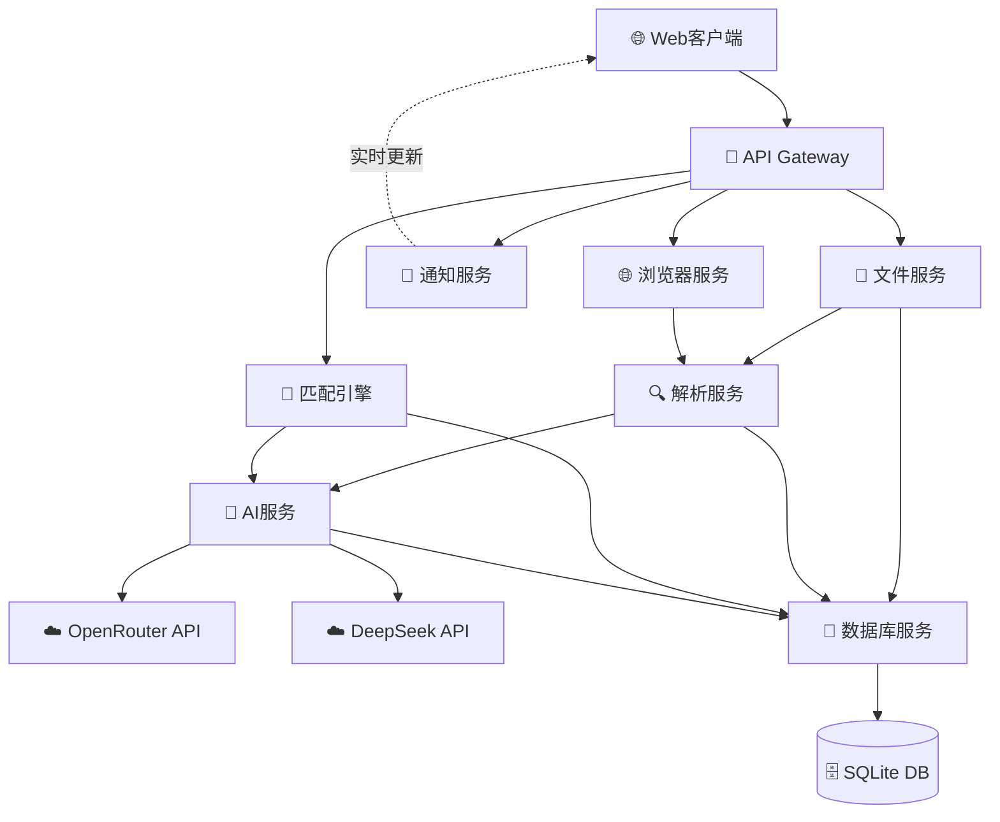

# 组件关系图

```mermaid
graph TD
    Client["🌐 Web客户端"] --> Gateway["📡 API Gateway"]
    
    Gateway --> FileService["📁 文件服务"]
    Gateway --> MatchingEngine["🎯 匹配引擎"]
    Gateway --> NotificationService["🔔 通知服务"]
    
    FileService --> ParserService["🔍 解析服务"]
    
    Gateway --> BrowserService["🌐 浏览器服务"]
    BrowserService --> ParserService
    
    ParserService --> AIService["🤖 AI服务"]
    MatchingEngine --> AIService
    
    AIService --> OpenRouter["☁️ OpenRouter API"]
    AIService --> DeepSeek["☁️ DeepSeek API"]
    
    FileService --> DatabaseService["💾 数据库服务"]
    ParserService --> DatabaseService
    MatchingEngine --> DatabaseService
    AIService --> DatabaseService
    
    DatabaseService --> SQLite[("🗄️ SQLite DB")]
    
    NotificationService -.->|"实时更新"| Client
```
