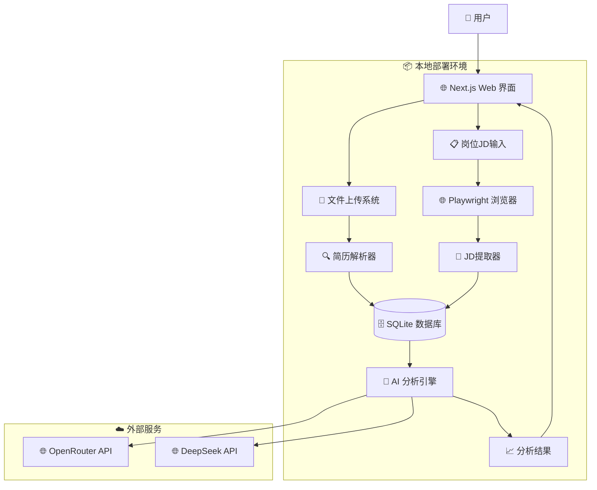

# 高层架构

## 技术摘要

ResumeXAgent采用基于Next.js的单体架构，集成前端和后端功能于一个应用中。系统使用TypeScript提供类型安全，使用SQLite进行本地数据存储，通过Playwright实现有头浏览器自动化。系统集成OpenRouter和DeepSeek API提供AI分析能力，针对本地部署场景进行优化，支持PRD中定义的智能简历优化和岗位匹配目标。

## 高层概览

基于PRD的技术假设部分：

1. **架构风格：** 单体架构（Monolith）- 所有功能集成在一个应用中，简化部署和维护，适合本地运行场景
2. **仓库结构：** Monorepo - 单一代码库管理所有代码，包括前端、后端和测试代码
3. **用户交互流程：** 用户上传简历→输入岗位JD→AI分析匹配→获得优化建议→生成沟通内容
4. **数据流程：** 文件上传→解析提取→结构化存储→AI分析→结果展示→删除临时文件
5. **核心架构决策：** 采用单体架构降低系统复杂度，通过Next.js API路由处理后端逻辑，优先考虑MVP开发速度

## 高层项目图表

## 架构和设计模式

以下是指导架构的关键高层模式：

- **单体架构模式：** 所有功能集成在一个Next.js应用中 - _理由：_ 符合PRD中的简化部署和维护要求，适合本地运行场景，加快MVP开发速度
- **仓库模式：** Monorepo管理所有代码 - _理由：_ 便于统一版本管理和代码共享，简化开发流程
- **API网关模式：** 使用Next.js API路由作为后端服务入口 - _理由：_ 统一请求处理，简化架构复杂度
- **数据访问层模式：** 使用Repository模式抽象数据访问 - _理由：_ 支持测试和未来数据库迁移灵活性
- **事件驱动模式：** 使用事件处理AI分析任务 - _理由：_ 支持异步处理和系统弹性，提升用户体验
