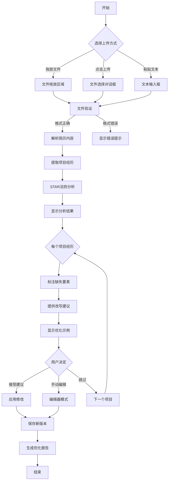
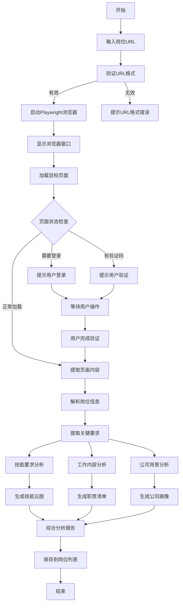
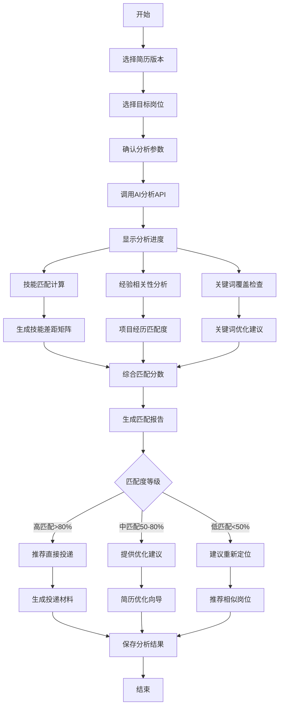
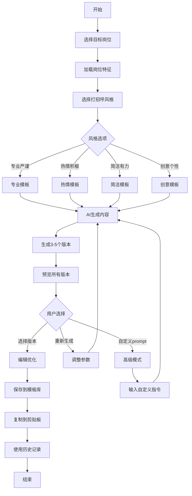

# ResumeXAgent UI/UX 规格文档

## 1. 介绍 (Introduction)

这份文档定义了ResumeXAgent求职助手的用户体验目标、信息架构、用户流程和视觉设计规格。它作为视觉设计和前端开发的基础，确保为求职者提供一个连贯且以用户为中心的体验。

### 整体UX目标与原则

基于PRD和头脑风暴的洞察，我为ResumeXAgent设计了以下用户体验框架：

**目标用户画像：**

1. **裸辞求职者（主要用户）：** 
   - 时间充裕但焦虑度高的技术人员
   - 需要快速识别简历盲区并优化
   - 关注项目经历与岗位的匹配度
   - 需要提高HR回复率

2. **在职求职者（次要用户）：**
   - 时间有限的专业人士
   - 需要高效分析岗位匹配度
   - 重视隐私和数据安全
   - 需要快速准备面试

3. **初级求职者（扩展用户）：**
   - 缺乏经验的应届生或转行者
   - 需要STAR法则指导
   - 需要项目经历优化建议
   - 需要求职策略指导

**可用性目标：**
- **易于学习：** 新用户能在5分钟内完成简历上传和第一次分析
- **使用效率：** 熟练用户能在2分钟内完成岗位JD分析和匹配度评估
- **错误预防：** 清晰的验证和指引，特别是STAR法则检测，防止"水分过大"问题
- **可记忆性：** 采用程序员熟悉的代码审查工具交互模式，降低学习成本
- **满意度：** 提供实时反馈和具体建议，减轻求职焦虑

**设计原则：**
1. **代码审查范式** - 采用程序员熟悉的IDE风格界面和交互模式
2. **数据驱动洞察** - 提供基于AI分析的具体建议，而非泛泛指导
3. **渐进式披露** - 复杂功能（如自定义AI Agent）按需展示
4. **即时反馈** - 类似代码编辑器的实时错误提示和建议标注
5. **隐私优先** - 本地处理，临时存储，给用户完全控制权

**理由说明：**
- 选择IDE风格是因为目标用户主要是程序员，降低认知负担
- 强调STAR法则检测是因为这是识别的核心痛点
- 隐私优先是因为简历包含敏感信息，本地部署增强信任
- 实时反馈模式借鉴代码开发体验，提升使用效率

### 变更日志

| 日期 | 版本 | 描述 | 作者 |
|------|------|------|------|
| 2025-08-06 | 1.0 | 基于PRD和头脑风暴结果创建初始UI/UX规格 | Sally (UX Expert) |

## 2. 信息架构 (Information Architecture)

基于PRD中定义的6个核心功能模块，我将创建一个IDE风格的信息架构，让程序员用户感到熟悉和高效。

### 站点地图 / 功能架构

```mermaid
graph TD
    A[ResumeXAgent] --> B[工作区 Dashboard]
    A --> C[简历管理]
    A --> D[岗位分析]
    A --> E[匹配分析]
    A --> F[AI助手]
    A --> G[设置]
    
    B --> B1[最近活动]
    B --> B2[待改进项]
    B --> B3[快速操作]
    
    C --> C1[简历列表]
    C --> C2[上传/导入]
    C --> C3[语法检测]
    C --> C4[STAR分析]
    C --> C5[版本历史]
    
    D --> D1[岗位列表]
    D --> D2[URL输入]
    D --> D3[JD分析]
    D --> D4[技能提取]
    D --> D5[公司分析]
    
    E --> E1[单个匹配]
    E --> E2[批量匹配]
    E --> E3[匹配报告]
    E --> E4[差距分析]
    
    F --> F1[打招呼生成]
    F --> F2[简历优化]
    F --> F3[面试准备]
    F --> F4[自定义Agent]
    
    G --> G1[API配置]
    G --> G2[主题设置]
    G --> G3[数据管理]
    G --> G4[快捷键]
```



### 导航结构

**主导航栏（顶部）- IDE风格：**
- **Logo/品牌** - ResumeXAgent
- **文件** - 新建简历、导入、导出、最近文件
- **编辑** - 撤销、重做、查找、替换
- **分析** - 运行检测、STAR分析、匹配分析
- **视图** - 布局切换、主题、面板显示/隐藏
- **工具** - AI配置、模板管理、批量处理
- **帮助** - 文档、快捷键、关于

**侧边栏（左侧）- 文件树结构：**
```
📁 我的简历
  📄 简历_v1.pdf
  📄 简历_v2_优化.md
  📄 简历_技术岗.pdf
📁 目标岗位
  🌐 前端工程师_字节跳动
  🌐 全栈开发_美团
  📌 已保存JD_20个
📁 匹配报告
  📊 2025-08-06_分析报告
  📊 批量匹配结果
```

**主工作区（中央）：**
- 标签页式界面，支持多个文档同时打开
- 分屏对比视图（简历 vs 岗位要求）
- 实时预览和编辑模式切换

**辅助面板（右侧）- 可折叠：**
- 问题面板（类似IDE的Problems面板）
- AI建议面板
- 属性检查器
- 快速操作面板

**底部状态栏：**
- 当前文件状态
- 字数统计
- AI模型状态
- 后台任务进度

**面包屑导航策略：**
- 显示当前位置路径：首页 > 简历管理 > 简历_v2 > STAR分析
- 支持快速跳转到任意层级
- 显示当前操作状态（如"正在分析..."）

**理由说明：**
- IDE风格的布局让程序员用户instantly感到熟悉
- 文件树结构便于管理多个简历版本和岗位
- 标签页支持多任务并行处理
- 问题面板模仿代码编辑器的错误提示方式
- 分屏视图便于对比分析

## 3. 用户流程 (User Flows)

基于PRD中的核心功能和用户痛点，我将设计以下关键用户流程。每个流程都针对头脑风暴中识别的具体问题。

### 流程1：简历上传与STAR法则检测

**用户目标：** 上传简历并检测项目经历是否符合STAR法则，避免"水分过大"问题

**入口点：** Dashboard快速操作 / 简历管理页面

**成功标准：** 用户获得具体的STAR改进建议并应用到简历中



**边缘案例与错误处理：**
- 文件过大（>10MB）：提示压缩或转换格式
- 非标准简历格式：提供手动标注项目经历功能
- 无项目经历：建议添加项目经历模板
- 解析失败：允许手动输入或编辑

**备注：** 类似代码review，每个问题都有具体行号定位和修改建议

### 流程2：岗位URL输入与智能分析（有头浏览器）

**用户目标：** 通过URL获取Boss直聘岗位信息，深度分析岗位要求

**入口点：** 岗位分析页面 / Dashboard快速操作

**成功标准：** 成功提取岗位关键信息并生成分析报告



**边缘案例与错误处理：**
- 网站反爬虫限制：保持浏览器窗口开启，用户手动操作
- 页面加载超时：提供重试和手动输入选项
- 内容提取失败：允许用户手动粘贴JD文本
- 多标签页处理：支持批量分析多个岗位

**备注：** 浏览器窗口可见，增加用户信任感和控制感

### 流程3：简历-岗位智能匹配分析

**用户目标：** 分析简历与目标岗位的匹配度，获得优化建议

**入口点：** 匹配分析页面 / 选中简历和岗位后的快速操作

**成功标准：** 获得详细的匹配报告和可执行的改进方案



**边缘案例与错误处理：**
- AI API调用失败：使用备用模型或基础规则匹配
- 分析时间过长：显示预计时间，支持后台运行
- 匹配度过低：提供技能提升路径建议
- 批量分析：支持队列处理和结果对比

**备注：** 匹配结果可视化展示，类似代码覆盖率报告

### 流程4：AI个性化打招呼生成

**用户目标：** 根据岗位特点生成吸引HR的打招呼内容

**入口点：** AI助手页面 / 岗位详情页的快速操作

**成功标准：** 生成3-5个不同风格的打招呼模板并选用



**边缘案例与错误处理：**
- 生成内容过长：自动截断并提示
- 包含敏感词：过滤并提供替代表述
- 风格不满意：支持混合风格和微调
- 批量生成：为多个岗位生成不同版本

**备注：** 每个生成结果都标注使用的模型和成本

## 4. 线框图和模型 (Wireframes & Mockups)

### 设计文件参考

**主要设计工具：** 建议使用 Figma 进行详细的视觉设计

**设计系统参考：** 
- VS Code 界面设计语言
- GitHub Desktop 的文件管理方式
- JetBrains IDE 的面板布局

### 关键界面布局

#### Dashboard（工作区首页）

**目的：** 为用户提供项目概览和快速操作入口

**关键元素：**
- 顶部状态栏：当前活跃项目、AI模型状态、快捷操作
- 左侧文件树：简历版本、岗位列表、历史记录
- 中央主区域：最近活动卡片、待处理问题列表、快速分析按钮
- 右侧面板：AI建议摘要、系统通知、性能统计

**交互要点：**
- 支持拖放文件到中央区域快速上传
- 卡片式布局支持快速扫描
- 问题列表支持一键跳转到具体位置

**设计文件参考：** dashboard-layout.fig

#### 简历分析界面（Resume Analyzer）

**目的：** 提供详细的简历分析和STAR法则检测

**关键元素：**
- 编辑器风格的文本展示区域
- 行号显示和问题标注（类似IDE的错误提示）
- 右侧问题面板：按严重程度分类显示
- 底部建议栏：显示当前选中问题的修改建议

**交互要点：**
- 点击问题自动定位到文档相应位置
- 支持内联编辑和实时预览
- 键盘快捷键支持（Ctrl+D复制行、Ctrl+/注释等）

**设计文件参考：** resume-analyzer.fig

#### 岗位分析界面（Job Analysis）

**目的：** 展示岗位JD分析结果和关键信息提取

**关键元素：**
- 左侧浏览器内嵌窗口（用于URL获取）
- 中央分析结果展示：技能要求、工作内容、公司信息
- 右侧相关建议：匹配度预估、关键词高亮
- 底部操作栏：保存岗位、开始匹配分析、生成打招呼

**交互要点：**
- 浏览器窗口可调整大小和最小化
- 分析结果支持标签页切换（技能/内容/公司）
- 支持直接从分析结果跳转到匹配分析

**设计文件参考：** job-analysis.fig

#### 匹配分析界面（Match Analysis）

**目的：** 展示简历与岗位的匹配分析结果

**关键元素：**
- 分屏对比视图：左侧简历，右侧岗位要求
- 中央匹配度仪表盘：总分、各维度得分
- 详细分析面板：技能匹配矩阵、经验相关性图表
- 改进建议列表：优先级排序，可点击应用

**交互要点：**
- 支持同步滚动对比内容
- 匹配高亮：相同技能自动高亮关联
- 建议应用：一键跳转到简历编辑模式

**设计文件参考：** match-analysis.fig

#### AI助手配置界面（AI Agent Config）

**目的：** 让用户自定义AI分析能力和模型选择

**关键元素：**
- 模型选择下拉菜单（OpenRouter/DeepSeek选项）
- Prompt编辑器：语法高亮、自动完成
- 预设模板库：常用分析类型快速选择
- 测试运行面板：实时预览AI分析结果

**交互要点：**
- Prompt编辑器支持代码风格的编辑体验
- 模板库支持拖拽重排序
- 测试运行显示API调用成本和耗时

**设计文件参考：** ai-config.fig

## 5. 组件库/设计系统 (Component Library / Design System)

### 设计系统方案

**基础技术栈：** Tailwind CSS + shadcn/ui + Radix UI

**设计理念：** 
- 借鉴现代IDE（VS Code、JetBrains）的视觉语言
- 优先功能性，确保信息密度和操作效率
- 支持深色/浅色主题无缝切换
- 保持一致的交互模式和视觉层级

### 核心组件

#### FileTree（文件树组件）

**目的：** 管理简历版本、岗位列表的层级展示

**变体：** 
- 标准模式：显示文件图标和名称
- 紧凑模式：减少行高，适用于大量条目
- 搜索模式：支持关键词过滤和高亮

**状态：** 
- 默认：正常显示
- 悬停：背景色变化，显示操作按钮
- 选中：高亮当前项
- 拖拽：半透明效果，显示拖放目标

**使用指南：** 支持键盘导航、右键菜单、拖拽排序

#### ProblemPanel（问题面板组件）

**目的：** 类似IDE的问题面板，显示简历检测问题

**变体：**
- 错误级别：红色图标，需要立即修复
- 警告级别：黄色图标，建议优化
- 信息级别：蓝色图标，提示性建议

**状态：**
- 展开：显示详细描述和建议
- 折叠：只显示摘要信息
- 已修复：灰色显示，划线标记

**使用指南：** 点击问题自动定位到文档位置，支持批量操作

#### AnalysisCard（分析卡片组件）

**目的：** 展示各种分析结果（匹配度、技能分析等）

**变体：**
- 数据展示型：包含图表、进度条、统计数字
- 操作建议型：包含建议列表、快速操作按钮
- 状态通知型：显示处理进度、成功/失败状态

**状态：**
- 加载中：显示骨架屏和进度指示器
- 完成：显示完整内容
- 错误：显示错误信息和重试按钮

**使用指南：** 支持展开/折叠、导出数据、快速操作

#### AIPromptEditor（AI提示词编辑器）

**目的：** 提供代码编辑器风格的prompt编辑体验

**变体：**
- 基础编辑器：语法高亮、行号、代码折叠
- 高级编辑器：自动完成、错误检查、格式化
- 模板模式：预设模板选择和参数配置

**状态：**
- 编辑中：光标闪烁、实时验证
- 运行中：显示执行状态和成本
- 结果展示：分屏显示输入和输出

**使用指南：** 支持常用编辑器快捷键、代码片段、版本历史

#### MatchVisualization（匹配可视化组件）

**目的：** 直观展示简历与岗位的匹配情况

**变体：**
- 雷达图：多维度匹配度对比
- 热力图：技能覆盖程度展示
- 流程图：经验相关性路径

**状态：**
- 交互中：支持悬停查看详情
- 对比模式：同时展示多个结果
- 导出模式：优化显示用于报告生成

**使用指南：** 支持缩放、筛选、数据钻取

### 组件使用原则

**一致性原则：**
- 所有组件遵循统一的间距系统（4px基准）
- 统一的颜色语义（成功、警告、错误、信息）
- 一致的交互反馈（悬停、点击、聚焦）

**可访问性原则：**
- 所有交互元素支持键盘操作
- 合适的颜色对比度（WCAG AA标准）
- 屏幕阅读器友好的语义标记

**性能原则：**
- 大数据组件支持虚拟滚动
- 图片和图标使用懒加载
- 组件按需加载，减少初始包大小

## 6. 品牌和样式指南 (Branding & Style Guide)

### 视觉标识

**品牌指导原则：** 专业工具感 + 技术友好 + 简洁高效

### 色彩系统

| 色彩类型 | 浅色主题 | 深色主题 | 用途说明 |
|---------|----------|----------|----------|
| Primary | #0066CC | #4A90E2 | 主要操作按钮、链接、选中状态 |
| Secondary | #6B7280 | #9CA3AF | 次要文本、边框、辅助元素 |
| Accent | #10B981 | #34D399 | 成功状态、积极反馈、匹配高分 |
| Success | #10B981 | #34D399 | 操作成功、通过验证、正面结果 |
| Warning | #F59E0B | #FBBF24 | 警告提示、需要注意的信息 |
| Error | #EF4444 | #F87171 | 错误状态、失败操作、严重问题 |
| Neutral | #F3F4F6/#374151 | #1F2937/#D1D5DB | 背景、文本、边框的基础色彩 |

### 字体系统

#### 字体族

- **主要字体：** Inter（系统UI字体，优秀的屏幕显示效果）
- **次要字体：** system-ui, -apple-system, sans-serif（系统回退）
- **等宽字体：** 'JetBrains Mono', 'Fira Code', Consolas, monospace（代码展示）

#### 字体比例

| 元素 | 大小 | 字重 | 行高 | 使用场景 |
|------|------|------|------|----------|
| H1 | 2.25rem (36px) | 700 | 1.2 | 页面主标题 |
| H2 | 1.875rem (30px) | 600 | 1.3 | 区块标题 |
| H3 | 1.5rem (24px) | 600 | 1.4 | 子标题 |
| Body | 0.875rem (14px) | 400 | 1.5 | 正文内容、界面文字 |
| Small | 0.75rem (12px) | 400 | 1.4 | 辅助说明、状态文字 |
| Code | 0.875rem (14px) | 400 | 1.6 | 代码展示、prompt编辑器 |

### 图标系统

**图标库：** Lucide React（轻量、一致、开源）

**使用指南：**
- 常规图标：16px × 16px
- 大图标：24px × 24px  
- 状态图标：12px × 12px
- 保持线条粗细一致（1.5px stroke-width）

**核心图标语义：**
- 文件：FileText、FileType、Upload
- 分析：BarChart、TrendingUp、Search
- AI：Cpu、Bot、Zap
- 状态：CheckCircle、AlertTriangle、XCircle
- 操作：Play、Settings、Download

### 间距和布局

**间距系统（基于Tailwind）：**
- **基准单位：** 4px（0.25rem）
- **组件内间距：** 8px, 12px, 16px
- **组件间距：** 16px, 24px, 32px
- **页面边距：** 24px, 32px, 48px

**栅格系统：**
- **容器最大宽度：** 1200px
- **断点：** sm(640px), md(768px), lg(1024px), xl(1280px)
- **侧边栏宽度：** 240px（可折叠到60px）
- **右侧面板：** 300px（可隐藏）

### 深色/浅色主题规范

**主题切换策略：**
- 系统主题检测 + 用户手动选择
- 平滑的颜色过渡动画（200ms ease-in-out）
- 主题状态持久化存储

**深色主题优化：**
- 降低全白色使用，采用略灰的白色（#FAFAFA）
- 提高关键信息的对比度
- 优化代码高亮配色方案
- 确保图表和可视化组件的可读性

### 视觉层级

**信息层级原则：**
1. **关键操作**：高对比度色彩、较大尺寸
2. **重要信息**：medium权重、适中大小
3. **辅助信息**：低对比度、较小尺寸
4. **背景元素**：最低对比度、不干扰主内容

**组件层级（z-index）：**
- 模态框：1000
- 下拉菜单：100
- 悬浮提示：50
- 固定元素：10
- 普通内容：1

## 7. 可访问性要求 (Accessibility Requirements)

### 合规目标

**标准：** WCAG 2.1 AA级别

**核心原则：**
- **可感知性：** 确保所有用户都能感知到信息和UI组件
- **可操作性：** 确保所有用户都能操作UI组件和导航
- **可理解性：** 确保所有用户都能理解信息和UI操作
- **健壮性：** 确保内容能被各种用户代理（包括辅助技术）可靠地解析

### 关键要求

#### 视觉设计

**颜色对比度要求：**
- 正常文字（14px以下）：至少4.5:1对比度
- 大字体（18px以上或14px粗体）：至少3:1对比度
- 图形和UI组件：至少3:1对比度
- 状态指示不能仅依赖颜色区分

**焦点指示器：**
- 所有交互元素都有清晰的焦点状态
- 焦点环颜色对比度至少3:1
- 焦点状态在深色和浅色主题中都清晰可见
- 支持高对比度模式

**文字尺寸：**
- 支持放大到200%而不丢失功能
- 最小字体大小不低于12px
- 行高至少为字体大小的1.5倍

#### 键盘交互

**键盘导航支持：**
- 所有交互功能都可通过键盘访问
- 逻辑清晰的Tab键顺序
- 支持常见快捷键（Ctrl+S保存、Ctrl+Z撤销等）
- 模态框和下拉菜单的焦点管理

**快捷键映射：**
- `Tab/Shift+Tab`：导航焦点
- `Enter/Space`：激活按钮和链接
- `Escape`：关闭模态框或取消操作
- `Arrow Keys`：在列表和树形控件中导航
- `Ctrl+F`：页面内搜索
- `F2`：重命名文件或项目

#### 屏幕阅读器支持

**语义化标记：**
- 使用适当的HTML语义元素（header、nav、main、section）
- 表单标签正确关联（label for属性）
- 列表使用ul/ol元素
- 按钮和链接有意义的文字描述

**ARIA属性：**
- `aria-label`：为图标按钮提供文字描述
- `aria-describedby`：关联帮助文本
- `aria-expanded`：折叠/展开状态
- `aria-live`：动态更新区域（分析进度、错误消息）
- `role`：复杂组件的角色声明

**内容结构：**
- 页面标题准确描述内容
- 标题层级逻辑清晰（h1 > h2 > h3）
- 跳转链接支持快速导航
- 图片有意义的alt属性

#### 特殊功能无障碍

**文件上传：**
- 拖拽区域有键盘替代方案
- 文件选择对话框可通过键盘操作
- 上传进度对屏幕阅读器可感知

**数据可视化：**
- 图表提供数据表格替代形式
- 颜色编码配合图案或文字标签
- 交互式图表支持键盘导航

**AI交互：**
- AI分析进度对屏幕阅读器可感知
- 错误和成功消息有声音提示选项
- 长时间操作提供进度反馈

### 测试策略

**自动化测试：**
- 集成axe-core进行自动化可访问性检测
- 颜色对比度自动检查
- 键盘导航自动化测试

**手动测试：**
- 使用屏幕阅读器（NVDA、JAWS、VoiceOver）测试
- 仅键盘导航测试
- 高对比度模式测试
- 200%缩放测试

**用户测试：**
- 邀请残障用户参与可用性测试
- 收集真实的辅助技术使用反馈
- 迭代改进基于用户建议

## 8. 响应式策略 (Responsiveness Strategy)

### 断点系统

| 断点名称 | 最小宽度 | 最大宽度 | 目标设备 | 优化重点 |
|---------|----------|----------|----------|----------|
| Mobile | 320px | 767px | 手机设备 | 核心功能，简化操作 |
| Tablet | 768px | 1023px | 平板设备 | 适中信息密度，触摸友好 |
| Desktop | 1024px | 1279px | 笔记本电脑 | 全功能，高效操作 |
| Wide | 1280px | - | 大屏显示器 | 充分利用空间，多面板 |

### 适配模式

**布局变化：**
- **Wide/Desktop：** 三栏布局（侧边栏 + 主区域 + 右面板）
- **Tablet：** 两栏布局（可折叠侧边栏 + 主区域）
- **Mobile：** 单栏布局，底部标签导航

**导航适配：**
- **Desktop：** 完整菜单栏 + 侧边文件树
- **Tablet：** 汉堡菜单 + 抽屉式侧边栏
- **Mobile：** 底部标签导航 + 顶部操作栏

**内容优先级：**
- **Mobile优先功能：** 简历上传、基础分析、结果查看
- **隐藏次要功能：** 高级设置、详细统计、批量操作
- **渐进增强：** 大屏逐步显示更多功能和信息

**交互适配：**
- **触摸优化：** 按钮最小44px，间距适中
- **手势支持：** 左右滑动切换标签，下拉刷新
- **上下文菜单：** 长按显示更多操作选项

## 9. 动画和微交互 (Animation & Micro-interactions)

### 动效原则

**动效哲学：** 
- 功能性优先：动画服务于用户理解和操作效率
- 性能友好：60FPS流畅度，避免影响核心功能
- 尊重偏好：支持`prefers-reduced-motion`设置

### 关键动画

#### 状态转换动画

**文件上传反馈：**
- 拖拽悬停：边框颜色变化（200ms ease-out）
- 上传进度：进度条填充 + 百分比数字计数
- 上传成功：绿色对勾动画（300ms bounce）
- 上传失败：红色摇摆动画（400ms ease-in-out）

**分析进度指示：**
- 加载状态：骨架屏淡入（150ms）
- 进度条：smooth填充动画（线性过渡）
- 数据更新：数字变化的数值动画（500ms ease-out）
- 完成状态：结果卡片从下方滑入（300ms ease-out）

#### 界面交互动画

**按钮反馈：**
- 悬停：轻微放大（scale: 1.05, 150ms）
- 点击：轻微缩小（scale: 0.95, 100ms）
- 加载中：旋转图标动画

**面板切换：**
- 侧边栏折叠：宽度变化（250ms cubic-bezier(.4,0,.6,1)）
- 标签页切换：内容滑动切换（200ms ease-in-out）
- 模态框：缩放淡入 + 背景遮罩淡入（200ms）

#### 内容展示动画

**数据可视化：**
- 图表绘制：路径动画（800ms ease-out）
- 数值变化：数字递增动画（600ms）
- 匹配度显示：圆形进度条填充（1000ms ease-out）

**列表更新：**
- 新增项目：从上方滑入（250ms ease-out）
- 删除项目：向右滑出 + 高度折叠（300ms ease-in）
- 排序变化：位置平滑过渡（400ms ease-in-out）

### 微交互设计

**悬停状态：**
- 文件项：背景色变化 + 操作按钮显示
- 问题项：高亮边框 + 详细信息展开
- 匹配卡片：轻微阴影增强 + 边框高亮

**焦点状态：**
- 键盘导航：明显的焦点环（2px实线）
- 输入框聚焦：边框颜色变化 + 标签上移
- 按钮聚焦：背景渐变 + 轻微外发光

**反馈动画：**
- 成功操作：绿色对勾 + 轻微弹跳
- 错误操作：红色摇摆 + 震动效果
- 警告提示：黄色脉冲边框
- 信息提示：蓝色渐入渐出

## 10. 性能考虑和下一步计划 (Performance Considerations & Next Steps)

### 性能目标

**页面加载性能：**
- **首屏加载时间：** < 2秒（Fast 3G网络条件下）
- **交互响应时间：** < 100ms（按钮点击到视觉反馈）
- **动画帧率：** 稳定60FPS，无掉帧

**资源优化：**
- **JavaScript包大小：** 初始包 < 200KB gzipped
- **图片优化：** 使用WebP格式，懒加载非关键图片
- **字体加载：** font-display: swap，预加载关键字体

### 设计策略

**大数据处理：**
- 虚拟滚动：文件列表和问题列表支持千级条目
- 分页加载：批量岗位分析结果分页展示
- 数据缓存：AI分析结果本地缓存30天

**AI交互优化：**
- 流式响应：AI分析结果实时流式显示
- 后台处理：长时间AI任务在Web Worker中运行
- 错误恢复：网络中断时的重连机制

**内存管理：**
- 组件懒加载：路由级别的代码分割
- 图片内存：大图片自动压缩和释放
- 状态清理：页面切换时清理临时数据

### 下一步行动计划

#### 即时行动（1-2周）

1. **创建设计原型**
   - 在Figma中创建高保真设计稿
   - 建立完整的组件库和设计系统
   - 设计关键界面的交互原型

2. **用户研究验证**
   - 与目标用户测试设计概念
   - 收集对IDE风格界面的反馈
   - 验证信息架构的易用性

3. **技术可行性验证**
   - 验证Playwright集成方案
   - 测试AI API响应时间和成本
   - 确认文件解析库的准确性

#### 设计移交清单

- [ ] 所有用户流程已文档化
- [ ] 组件库设计完成
- [ ] 品牌和视觉规范确立
- [ ] 可访问性要求明确
- [ ] 响应式设计规范完整
- [ ] 动画和微交互定义清晰
- [ ] 性能目标设定合理

### 推荐后续工作

**与架构师协作：**
- 基于UX规格创建技术架构设计
- 确定组件实现的技术方案
- 制定开发里程碑和测试策略

**与开发团队协作：**
- 建立设计到开发的交付流程
- 设置设计审查和质量检查点
- 创建组件开发的优先级排序

**持续优化计划：**
- 用户使用数据收集和分析
- A/B测试关键交互流程
- 根据反馈迭代设计决策

---

*UI/UX规格文档 v1.0 - 为ResumeXAgent项目提供完整的用户体验设计指导*